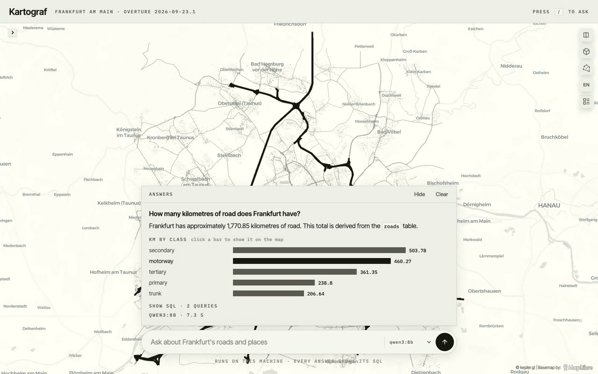

# Kartograf

Ask a city map a question. A language model running on your laptop writes
spatial SQL over open [Overture Maps](https://overturemaps.org) data for
Frankfurt, DuckDB runs it read-only, and the answer comes back with a chart, the
matching places on a [kepler.gl](https://kepler.gl) map, and every SQL statement
behind it. An eval harness scores local models on 20 questions with reference
answers, in English and German.



- **Local by default.** Qwen3 8B or Llama 3.1 8B through Ollama. No data leaves
  the machine; Claude through the Anthropic API is an option in the workbench.
- **Auditable.** The model gets one tool, `run_sql`. Every statement passes a
  read-only guard, runs in an in-memory DuckDB with external access disabled,
  and is listed with the answer.
- **Charts that explain the number.** Totals are rerun grouped by road class or
  place category with the model's own filter, so a wrong filter shows.
- **Measured.** Baseline: Qwen3 8B 15 of 20, Llama 3.1 8B 12 of 20, runnable SQL
  for every answerable question. See [Evals](#evals).

## Quickstart

Needs Python 3.11 or newer, about 10 GB of disk for two models, and 16 GB of RAM.

```bash
git clone https://github.com/BRKMYR/kartograf && cd kartograf
python3 -m venv .venv && source .venv/bin/activate
pip install -r requirements.txt

brew install ollama && ollama serve &      # or the Ollama app from ollama.com
ollama pull qwen3:8b                       # web app default
ollama pull llama3.1:8b                    # optional second model

# Frankfurt roads and places from the public Overture bucket, about 40 MB
python fetch_overture.py --preset frankfurt --releases 2026-09-23.1 --places \
    --map-classes motorway trunk primary secondary tertiary

python server.py                           # open http://localhost:8766
```

Try "How many kilometres of road does Frankfurt have?" or "How many pharmacies
are within 1 km of the main station (lon 8.6625, lat 50.1070)?".

## The Streamlit workbench

```bash
streamlit run app.py
```

The workbench has six surfaces: a chat that writes auditable SQL, a kepler.gl
map, a release-coverage view over Overture data for Germany, per-table
statistics, the raw data with a SQL box, and a query log. Ollama is the default
provider; set `ANTHROPIC_API_KEY` to use Claude instead.

Pick "Frankfurt am Main area" in the sidebar, click "Load latest release as roads +
places", then ask:

- How many pharmacies are within 1 km of Frankfurt Hauptbahnhof (lon 8.6625, lat 50.1070)?
- Wie viele Krankenhäuser liegen im Umkreis von 2 km um den Römer (lon 8.6821, lat 50.1106)?
- Which road class has the largest total length?

The tables load under short names (`places`, `roads`, `road_stats`), because a
small model writes `places` correctly far more often than a release-stamped name.

Without any downloads, "Load sample data" adds synthetic Berlin charging sessions
plus district polygons. Try:

- Which district has the highest average energy per session?
- How many sessions happened inside pilot-zone districts? Use the bounding boxes.
- Total revenue per operator, sorted.

## The web app: map plus agent search

`python server.py`, then http://localhost:8766.

A single page in the Kartograf look (Inter Tight, IBM Plex Mono labels, the
warm monochrome palette of the BRKMYR site): the kepler.gl map fills the screen
and the ask bar sits at the bottom centre, with suggestions until the first
question. Answers slide up above the bar as a thread you can hide or clear.
Questions work in English or German. Each answer comes with:

- **the answer text** from the local model (Qwen3 8B with thinking off by default,
  about 10 to 25 seconds; Llama 3.1 8B selectable in the header),
- **a chart**: when the model's query is a simple total over `roads` or `places`,
  the server reruns it grouped by road class or place category, so
  "Wie viele Straßenkilometer hat Frankfurt?" comes back with km per class,
- **the matching places on the map**, highlighted in ink, and the map flies to them,
- **clickable bars**: click "motorway" and those 767 segments light up on the map
  (`/api/highlight`, whitelisted columns, value bound as a SQL parameter),
- **every SQL statement**, the model's and the ones Kartograf added for the chart
  and the map, labelled by who wrote them.

Deriving the chart on the server, instead of asking the model for a second
query, was a measured decision: with the longer prompt, Llama 3.1 8B started
writing failing SQL and invented a road total. The model now gets one short
data-context note (the tables are Frankfurt; roads are classified roads only), and
the breakdown reuses the model's own filter verbatim, so the chart explains the
model's number, including when it is wrong. `?q=...` in the URL asks on load.
Keyboard: `/` focuses the bar, Enter asks, Up and Down recall earlier questions,
Esc hides the thread.

The server binds to 127.0.0.1 only. Model output is rendered as text, never as HTML.

## The Map tab: kepler.gl

The Map tab draws any loaded table that has `lon`/`lat` columns or GeoJSON
geometry, or the result of a read-only query you type, for example
`SELECT * FROM places WHERE category = 'pharmacy'`. Chat answers whose SQL
returned coordinates get a "Show on map" toggle.

- **kepler.gl 3.2.6**, the latest stable release, loaded from unpkg as in the
  upstream `examples/umd-client`. No Python `keplergl` package, which would pull in
  Jupyter and cannot set the UI theme.
- **Light theme** (`theme="light"`) with the CARTO Positron basemap; dark mode
  switches to Dark Matter. Neither needs a Mapbox token.
- **Data stays in the browser.** Tables are embedded as CSV and parsed client-side.
  Every `<` in the data is escaped, so uploaded content cannot break out of the page script.
- Point tables become point layers. Lines and polygons become one GeoJSON layer.
  Up to 200,000 rows per table.

## Real map data: Overture Maps

`fetch_overture.py` pulls road statistics and a motorway map layer straight from the
public Overture S3 bucket with DuckDB. No credentials, no SDK, no local database.

Check the cost first, then fetch. The estimate reads only Parquet footers:

```bash
python fetch_overture.py --preset berlin --estimate
python fetch_overture.py --preset berlin
python fetch_overture.py --preset germany      # the full country
```

Presets: `germany`, `bayern`, `nrw`, `berlin-brandenburg`, `berlin`, `saarland`, `frankfurt`, or any
`--bbox XMIN YMIN XMAX YMAX`. Each lands in its own folder, `data/overture/<scope>/`:

| File | Contents |
|---|---|
| `stats_<release>.csv` | segments, kilometres, mean segment length and name coverage by state and road class |
| `roads_<release>.geojson.gz` | motorway and trunk geometry, simplified to ~50 m, 5 decimals, gzip |
| `scope_<release>.json` | area, classes and method; releases are only compared when these match |
| `places_<release>.geojson.gz` | with `--places`: points of interest with name, category (`taxonomy.primary`), basic category, confidence, operating status, locality |

`--map-classes` widens the map geometry beyond motorway and trunk; a city needs
primary to tertiary as well.

Shared caches in `data/overture/`: `states_de.parquet` (German state boundaries, fetched
once) and `.meta/` (Parquet footer summaries that make later estimates instant).

### Transfer and storage

Geometry is about 93% of every download and is required to compute kilometres, so the
two levers are reading it once and choosing a smaller area. Transfer per release, as
estimated from Parquet footers:

| Scope | Single pass | Earlier two-pass version |
|---|---|---|
| Germany | ~2.7 GB | ~5.3 GB |
| Bayern area | ~0.85 GB | ~1.7 GB |
| Berlin-Brandenburg area | ~0.22 GB | ~0.45 GB |
| Berlin area | ~0.06 GB | ~0.11 GB |

The first fetch also reads German state boundaries once. On disk, Germany for two releases
is 6.3 MB and the Berlin area 0.1 MB. `python fetch_overture.py --compact` converts map
files from older runs in place and verifies every ID and length before deleting the original.

The Python environment is the real footprint, about 470 MB, mostly pyarrow, pandas and
DuckDB, which Streamlit and the pipeline need.

Presets other than Germany are rectangles, so they also clip neighbouring states. The app
labels them as areas and lists kilometres per state.

Scope decisions, all recorded per release in `scope_<release>.json`:

- **Default scope is the classified network**: motorway, trunk, primary,
  secondary, tertiary. Adding residential, unclassified and living_street
  (`--classes`) adds rows but not transfer, since the class filter cannot skip
  Parquet row groups. Footways, service roads, steps, tracks and cycleways are
  never counted; they are about 86% of Overture segments and would make a
  "kilometres of road" figure meaningless.
- **Releases are only compared when their scope matches.** Same bounding box,
  same classes. The app refuses the comparison otherwise and says why.
- **Overture kilometres are not official route kilometres.** Each carriageway
  direction is its own segment and ramps carry the motorway class. For the
  2026-07-22 release that puts motorway at about 3.2 times the official
  Autobahn length and primary to tertiary at 1.4 to 1.5 times the
  Bundes-, Landes- and Kreisstraßen figures. The state ranking matches official
  statistics.
- **Kilometres are geodesic**, from `ST_Length_Spheroid` on the full geometry,
  and a segment is attributed to the state containing its centroid, snapped to a
  0.01 degree grid.

## Data sources and attribution

Road and boundary data © OpenStreetMap contributors, Overture Maps Foundation.
Available under the [Open Database License (ODbL)](https://opendatacommons.org/licenses/odbl/).
Recommended citation: Overture Maps Foundation, overturemaps.org.

- **Transportation theme** (road segments): ODbL. Includes contributions from TomTom
  and OpenStreetMap.
- **Divisions theme** (German state boundaries): ODbL. The theme also draws on
  geoBoundaries, Esri Community Maps and LINZ (CC BY 4.0).
- **Places theme** (points of interest): no single licence. Sources are under CDLA
  Permissive 2.0 (Meta, Microsoft and others), Apache 2.0 (Foursquare Labs, Inc.)
  and CC0 1.0 (AllThePlaces). See docs.overturemaps.org/attribution.
- **Basemap** in the difference map and the kepler.gl map: © CARTO, © OpenStreetMap contributors.

This is an independent project. It is not affiliated with, endorsed by or sponsored by
the Overture Maps Foundation, the OpenStreetMap Foundation or TomTom.

Downloaded extracts and the statistics derived from them stay in `data/overture/`, which
is excluded from git, and every `scope_<release>.json` records source and licence. If you
publish derived statistics or maps, keep the attribution above and check the ODbL
share-alike terms for derived databases.

The Berlin charging sessions and districts in `sample_data/` are synthetic. Operator names
are illustrative and the sessions do not describe any real operator.

## The Releases tab

Answers two questions: how much road is in this dataset, and what changed.

- **Headline figures** for the newest release, with the delta against the previous one.
- **Weekly time series** of network length. Overture ships monthly, so only the
  release weeks are measured; the weeks between are simulated from the real
  anchors and are labelled as such everywhere they appear. On a release date the
  simulated value *is* the measured value.
- **A synthetic data-quality incident** is injected into two of the simulated
  weeks, and the week-over-week monitor catches it. That is the point of the
  view: a coverage chart that cannot catch a regression is decoration.
- **Change by road class** as small multiples, indexed to the first week on one
  shared percent axis. Classes differ by an order of magnitude in length, so raw
  kilometres on a shared axis flatten the small ones, and independent axes stretch
  a change of a few kilometres to full panel height. The index keeps real small
  changes small and makes a regression stand out.
- **Simulated weeks carry no random noise.** An earlier version added a little,
  and on zoomed axes it read as real week-to-week volatility. Between releases the
  line is plain interpolation; the injected incident is the only deviation.
- **Release comparison** with diverging bars, blue for kilometres gained and red
  for kilometres lost, plus the full table.
- **A difference map** of motorway and trunk: grey for segments in both releases,
  blue for segments new in B, red for segments gone from B, matched by the stable
  Overture GERS id.

Everything on the tab is downloadable as CSV.

## Layout

```
app.py           Streamlit UI: sidebar, chat, map, releases, statistics, data, query log
server.py        Web app API on localhost: base layers, ask, chart and map derivation
web/             index.html (map plus agent search) and kartograf-theme.js (shared kepler theme)
kepler_view.py   kepler.gl page builder: light/dark theme, token-free basemap, escaped data
run_evals.py     Eval runner and scorer: number, set and refusal checks per question
evals/           questions.yaml (20 DE/EN questions) and results/ (JSONL per model, SUMMARY.md)
data_loader.py   CSV / GeoJSON parsing, geodesic length, DuckDB store, read-only SQL guard
llm.py           Tool loop for Claude (Anthropic SDK) and Ollama; system prompt
snapshots.py     Release stats, version comparison, weekly series, anomaly detection
charts.py        Altair specs and the validated colour palette
fetch_overture.py Overture download over S3 via DuckDB, estimate, compaction
scopes.py        Region presets, dataset folders, gzip helpers
test_core.py     Loader, SQL guard, statistics, tool loop against a fake model
test_releases.py Release stats, weekly series, incident injection, chart specs
test_storage.py  Presets, transfer estimate, compaction with verification, gzip loading
test_kepler_view.py  Theme, pinned version, row cap, script-block escaping
test_evals.py    Number parsing (German and English), scorer, question file balance
test_server.py   Derived breakdown and map queries, chart selection
sample_data/     Synthetic CSV + GeoJSON so the app runs without any real data
data/overture/   One folder per region plus shared caches (gitignored, reproducible)
query_log.jsonl  Appended per turn: question, SQL, answer, latency, tokens (gitignored)
```

GeoJSON is parsed in pure Python: each feature becomes a row with its properties
flattened, plus `geom_type`, a representative `lon`/`lat`, a bounding box, the
raw geometry string, and `length_km`, the geodesic length of line geometries.
Polygons return null length on purpose, because a perimeter is not a length.
Where the DuckDB spatial extension is available, `ST_*` functions also work on
`ST_GeomFromGeoJSON(geometry_geojson)`.

## Tests

```bash
.venv/bin/python -m pytest -q
```

85 tests, no network, no API key and no Ollama needed. They cover the SQL guard
against injection and write attempts, the geodesic length against known distances,
the tool loop recovering from a bad query, the weekly series matching its real
anchors exactly, the refusal to compare releases of different scope, every chart
spec in light and dark mode, the kepler page builder, and the eval scorer.

## Evals

```bash
python run_evals.py --model llama3.1:8b --model qwen3:8b
```

`evals/questions.yaml` holds 20 questions over the Frankfurt extract, 10 in
English and 10 in German:

- **12 counts and lengths** (`number`): distance queries around landmarks, class
  totals, closed places. Pass if the answer contains the reference value.
- **2 rankings** (`set`): pass if the answer names every expected value.
- **4 unanswerable questions** (`refusal`): accidents, speed limits, construction
  sites, rents. The data has none of these; pass if the model says so instead of
  inventing a number.

Expected answers are not hard-coded. Each answerable question carries a
`reference_sql` that runs against the same data, so the set stays valid when the
Overture release changes. Distance questions name their anchor coordinates,
because the places data contains duplicate and misplaced station names (one
"München Hauptbahnhof" sits in Frankfurt). German questions use everyday words
("Apotheken", "Grundschulen"), so the model has to map them to Overture's English
category values itself.

Every turn is written to `evals/results/<date>_<model>.jsonl` with the SQL, the
answer and the verdict, so any borderline call can be re-labelled by hand.
`evals/results/SUMMARY.md` has the table.

### Baseline, 2026-10-05 (Overture 2026-09-23.1, MacBook with Apple M4 and 16 GB RAM)

| Model | Correct | English | Deutsch | Refusals | Valid SQL | Median latency |
|---|---|---|---|---|---|---|
| llama3.1:8b | 12/20 | 6/10 | 6/10 | 3/4 | 16/16 | 8.9 s |
| qwen3:8b | 15/20 | 9/10 | 6/10 | 4/4 | 16/16 | 101.3 s |

What the failures say:

- **Valid SQL is not the problem.** Every answerable question produced SQL that ran.
  The errors are in what the SQL means.
- **Guessed category values are the biggest failure class.** The models wrote
  `operating_status = 'permanently closed'`, `'closed'` or `'dauerhaft geschlossen'`
  instead of `'permanently_closed'`, and got 0 without noticing. They only see three
  sample rows, so they never learn which values exist. Next change to measure: list
  the distinct values of low-cardinality columns in the schema prompt.
- **German is where both models drop.** Both scored 6/10 in German. Qwen fell from
  9/10 in English, mostly on mapping words like "Grundschulen" to Overture's English
  categories (it tried `school` plus a made-up subcategory).
- **Llama invented one answer.** Asked for construction sites, which the data does
  not have, it counted `engineering_service` businesses and reported 346
  "Baustellen". Qwen refused all four unanswerable questions.
- **Llama sometimes forgets the number.** Two answers only named the table they used.
- **Qwen is 11 times slower** because it reasons before every tool call. On this
  machine that means 1 to 2.5 minutes per question, against about 9 seconds.
- **One failure was ours, not the models'.** On `de08` both wrote
  `is_named = TRUE`, which returned 0 because the compact road files omit `is_named`
  when it is true. The loader now restores the default. The same SQL returns the
  expected 9, so both scores are one too low; the next run will show it.

Small local models are fast enough to explore with. On their own they are not
reliable enough to trust with a number nobody checks, which is why every answer
comes with its SQL.

## Licence

Code: [MIT](LICENSE). Data, models and libraries keep their own licences; see
[THIRD_PARTY_NOTICES.md](THIRD_PARTY_NOTICES.md). In short:

- Overture extracts are not in this repository. `fetch_overture.py` rebuilds them,
  and anything you publish from them needs the attribution above (ODbL for roads,
  per-source licences for places).
- No model weights are included. Kartograf calls models you install through
  Ollama, under their own licences (Qwen3: Apache 2.0; Llama 3.1: Llama 3.1
  Community License).

Independent project. Not affiliated with, endorsed by or sponsored by the Overture
Maps Foundation, the OpenStreetMap Foundation, Foursquare, Meta, Alibaba or CARTO.

